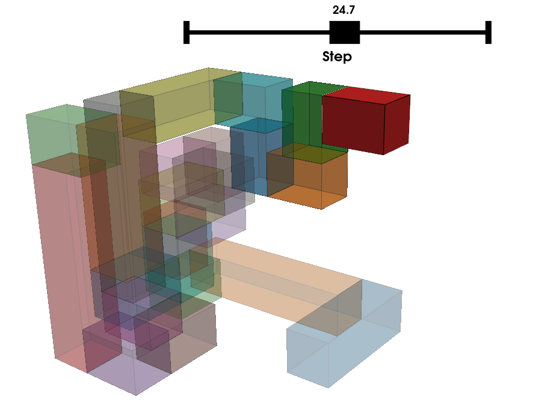
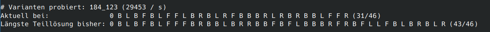

# Snakecube

Löst das Schlangenwürfel-Puzzle (Snake Cube) – ein hölzernes Geduldsspiel, bei dem eine
Kette von kleinen Würfelchen zu einem n×n×n-Würfel gefaltet werden muss.




## Das Puzzle

Der Schlangenwürfel besteht aus einer Kette von Einheitswürfeln, die durch elastische
Bänder verbunden sind. An bestimmten Stellen lässt sich die Kette um 90° abknicken. Ziel
ist es, die Kette so zu falten, dass ein kompakter Quader (meist 3×3×3 oder 4×4×4) entsteht.

Die Konfiguration eines Würfels wird als Folge von Zahlen angegeben. Jede Ziffer beschreibt
die Länge eines geraden Abschnitts (Anzahl Würfelchen bis zum nächsten Knick). Beispiel für
einen 3×3×3-Würfel: `31121211221112222`

## Algorithmus

Der Solver verwendet einen **Backtracking-Algorithmus** mit frühzeitiger Pruning-Erkennung:

- Das erste Segment wird immer entlang der +x-Achse gelegt, das zweite entlang +y
  (Symmetriereduktion).
- Jedes folgende Segment biegt 90° ab und kann in vier relative Richtungen gehen:
  vorwärts (F), rückwärts (B), links (L) oder rechts (R).
- Ein Ast wird sofort verworfen, wenn das neue Segment den Zielquader überschreiten würde
  oder bereits belegte Zellen trifft.
- Über `start-from` kann die Suche bei einem bestimmten Teilzustand fortgesetzt werden,
  um z. B. eine unterbrochene Suche beim 4×4×4-Würfel wieder aufzunehmen. Als
  Eingabe dient der Lösungszustand, der fortlaufend in der Konsole ausgegeben
  wird.

Auf einem modernen Rechner wird die Lösung des 3er-Würfels praktisch sofort
gefunden. Den 4er zu lösen kann ein bis mehrere Stunden dauern.

## Interaktive 3D-Anzeige

Im **Movie-Mode** wird die Lösung wird live in einem **PyVista**-Fenster
visualisiert. Während der Backtracking-Algorithmus in einem Hintergrundthread
läuft, aktualisiert der Hauptthread alle 100 ms die Darstellung mit dem jeweils
besten gefundenen Teilzustand. Nach Abschluss der Suche kann mit einem
Schieberegler Schritt für Schritt durch die Faltung geblättert werden.

Bei deaktiviertem Movie-Mode erscheint das Lösungsfenster erst nach Fund der
Lösung. Die Lösungssuche geht dann *erheblich* schneller (mindestens Faktor 10).

## Nutzung

```
snakecube
```

Das interaktive Menü fragt:

1. **Würfel**: `3` für 3×3×3, `4` für 4×4×4, oder eine eigene Segmentfolge eingeben.
2. **Startpunkt**: Optional eine bereits bekannte Teilfaltung angeben
   (z. B. `0 B L B F B L F`), um die Suche dort fortzusetzen. (Beispiel ist ca.
   387000 Varianten "vor" der Lösung des 4er Würfels.)
3. **Movie-Mode**: `J` für Echtzeit-Animation des Suchverlaufs, `N` für schnelle Suche
   mit Ausgabe erst am Ende.

Während der Suche wird regelmäßig ausgegeben, wie viele Varianten bereits ausprobiert
wurden und wie weit die längste bisher gefundene Teillösung reicht.

## Installation

Direkt von GitHub installieren:

```bash
# pip
pip install git+https://github.com/loehnertj/snakecube.git

# pipx (empfohlen – isolierte Umgebung, snakecube-Befehl global verfügbar)
pipx install git+https://github.com/loehnertj/snakecube.git

# uv
uv tool install git+https://github.com/loehnertj/snakecube.git
```

Für Entwicklung (Repository klonen):

```bash
git clone https://github.com/loehnertj/snakecube.git
cd snakecube
uv sync          # oder: pip install -e .
```

## Abhängigkeiten

- Python ≥ 3.13
- [PyVista](https://pyvista.org/) – 3D-Visualisierung
